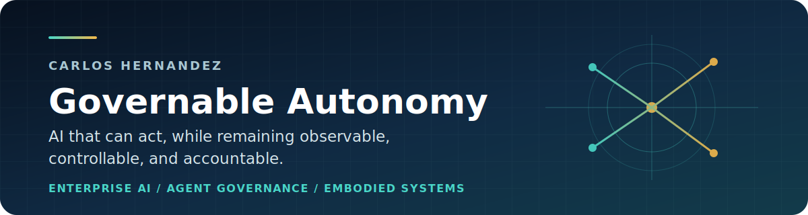

<p align="center">
  
</p>

<p align="center">
  <strong>AI strategy lead and open-source builder working from enterprise AI to embodied systems.</strong>
</p>

<p align="center">
  <a href="https://governance.ai-mvp.com/">Field Notes</a>
  &nbsp;&middot;&nbsp;
  <a href="https://www.linkedin.com/in/carloshvp">LinkedIn</a>
  &nbsp;&middot;&nbsp;
  <a href="https://genai-gurus.com/">GenAI Gurus</a>
</p>

## From strategy to systems

| Scale | Govern | Embody |
| :--- | :--- | :--- |
| Move AI from strategy to deployment in complex industrial organizations. | Build runtime controls, approval boundaries, telemetry, and verifiable evidence. | Apply those controls to agents and machines acting in the physical world. |

> **Current question:** How do we give increasingly autonomous systems useful
> freedom to act without losing human control or accountability?

## Proof in public

| Project | What I contributed |
| --- | --- |
| **[Microsoft Agent Governance Toolkit](https://github.com/microsoft/agent-governance-toolkit/pulls?q=is%3Apr+is%3Amerged+author%3Acarloshvp)** | Nine merged contributions spanning fail-closed sandboxing, action-bound approval, physical-agent risk mapping, and compliance evidence |
| **[AgenTrust examples](https://github.com/agentrust-io/examples/pulls?q=is%3Apr+is%3Amerged+author%3Acarloshvp)** | Industrial embodied-AI governance example and guidance for preserving evidence across controller restarts |
| **[Practical AI Governance for Builders](https://governance.ai-mvp.com/)** | Technical field notes connecting regulation to runtime controls and engineering practice |
| **[Awesome EU AI Act](https://github.com/GenAI-Gurus/awesome-eu-ai-act)** | Maintainer of a curated implementation resource for builders and governance teams |
| **[GenAI Gurus](https://genai-gurus.com/)** | Founder of a practitioner community for applied generative AI |

## Current focus

```text
ENTERPRISE AI
     |
     v
AGENT RUNTIME CONTROLS
     |
     v
EMBODIED AND PHYSICAL AI
```

- Runtime policy enforcement and hardened execution
- Human approval bound to a specific action and context
- Evidence continuity across agent and robot lifecycles
- Industrial deployment patterns for embodied AI

## Selected field notes

| | |
| --- | --- |
| **[Software Promises, Hardware Proofs](https://governance.ai-mvp.com/2026/06/12/software-promises-hardware-proofs/)** | Verifiable trust for agents that control robots |
| **[Ten Thousand Safe Motions](https://governance.ai-mvp.com/2026/06/06/ten-thousand-safe-motions/)** | The risks that emerge when autonomous agents control physical systems |
| **[Coding Agents Safely](https://governance.ai-mvp.com/2026/05/28/coding-agents-safely/)** | Enterprise controls for autonomous coding agents |

<p align="center">
  <strong>Building AI systems that can act while remaining observable, controllable, and accountable.</strong>
  <br><br>
  <a href="https://www.linkedin.com/in/carloshvp">Connect on LinkedIn</a>
</p>
